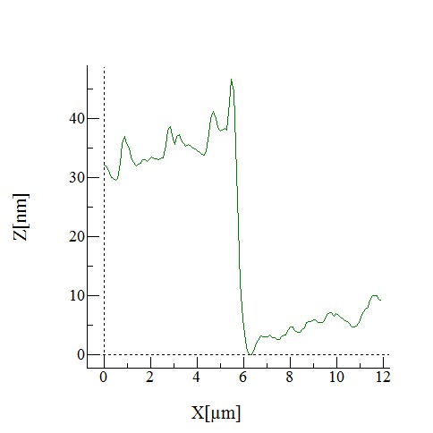

# Nanobubbles Project Log

**_All work below was undertaken and compiled by Niall Mulkerns and Shivani Shah. Please do not copy any parts of this - this is meant only as a reference for the authors._**

## Table of Contents
- [To Do List](#to-do-list)
- [Project Aims](#project-aims)
- [Log of Project Improvements/Directions](#log-of-project-improvementsdirections)
- [Skills Learnt](#skills-learnt)
- [Data](#data)

---

## To Do List
- **POSTER STUFF - FOR WEDNESDAY 19TH MARCH.**
  - Look into the theory of the chemistry behind creating the cell (silanisation/SAM etc).
  - Think about the kind of questions they might ask about nanobubbles in poster/presentations (i.e. read some more review papers on nanobubbles and get the basics right, optics, AFM theory etc).
    - "What is the mechanism of the bubbles sticking?".
- 3D print new lid.
- Clean glass (in plasma cleaner and chemically) and gold slide.
- Image the clean glass with the AFM.
- Make new cell using Ben.
- Disassemble Bill and clean it.
- Find the macroscopic contact angle of bubbles. Also with surfactants? In answer to the bubble sticking question.
- Figure out how to make the movie files from the TIRF smaller (change exposition time and something else).

---

## Project Aims

- To create and monitor bubbles in the TIRF system inside Bill. Including:
  - How the bubbles fluctuate thermally in the x/y direction.
  - How they change in radius/height over time.
  - Determine the resolution of the TIRF.
  - Find the smallest bubbles that can be created and at what voltage.
  - Frequency of bubble creation against time/voltage (how many bubbles visible at each time as a function of voltage).
  
- Create a theoretical model of the thermal fluctuations in bubbles.

---

## Log of Project Improvements/Directions

- At first, the project was focussed upon using the AFM and TIRF to examine the growth and other properties of electrochemically and/or static nanobubbles. AFM was featured more due to its wider use in literature, as TIRF has only been used very sparsely.

- Started out with the idea of using ITO (Indium Tin Oxide) as the substrate for bubbles and the cell being made ofrom two slides separated by a small spacer (potentially made from an O-ring or double-sided tape). The liquid would be contained within, most likely by capillary action and surface tension. 

- We had to learn about electrochemistry and how the cell would work. The working electrode would be the surface to create bubbles on, the counter would be an inert metal (platinum-iridium wire - inert over a wide range of potentials) and the reference would be a specifically created silver chloride wire. 

- The first phase was to create a initial iteration of a cell on the microscope such that macro bubbles could be observed, both on a surface and also on a wire.

- Found bubbles easily using potentiostat for steel wire and thick gold surface (non-transparent). Next to try was to find bubbles on an ITO surface. 

- Found that ITO would not support bubbles on the surface like gold would, the coating would be destroyed/fall off by the low potentials (although we did not know this at the time because the ITO is transparent). There would also be a change in colour before that time, which was found to be documented in literature, after which the coating sloped off.

- Thought that it might be to with poor contact from the cell connection to the ITO coverslip, and created many different prototypes to try to combat this, none of which worked. Contact made using silver paint and copper strips, as well as using conductive glue. Thought it could also be due to contamination from plastic, but this was proved wrong when done inside a glass elctrode cell. 

- Tried to determine the "bubble point" of the thick gold sample, as the ITO samples were not producing bubbles. Found that the "dirty" (i.e. not cleaned) gold sample had a significantly higher bubble point (approx -1040 mV) than that of the clean gold sample (approx 575 mV). [Not sure about this as logic dictates that the bubble point should be lower for the dirty sample as the bubbles form around impurities on the surface. Also unsure that the cell was set up correctly for these values to be 100% true].  

- Then tried to deposit silver coating onto the ITO coverslips, however, this silver coating was again delaminated when the coverslip was exposed to low potetnials, approx -1 V, with no bubbles being formed either. The silver coating did take, but was no good for use in the cell due to no bubbles and loss of conductivity/coating at low potential values.

- After this, we decided to try evaporating a gold surface onto the ITO coverslips, which unfortunately did not work either due to reasons mentioned above. Then found the papers on ITO delamination at low potentials [Senthikumar et al 2007] and decided to change tact and start work with normal glass coverlsips instead. However, it is well known that glass and gold do not adhere well to each other, so an adhesive layer must be present between the two to stop the gold from peeling away from the glass at low potentials.
  - Calculated the approximate amount (in grams) of gold needed to get a 10 nm coating on the slide given a certain distance from the source and assuming isotropic hemispherical coverage. Found that less gold than calculated was needed (settled on approxmately 80% of first value calculated), most likely due to the bowl, focussing the evaporate in the centre, causing the coverage to be non-isotropic. 

- Explored multiple options:
  - Electroless plating [Hu et al. 2007]: glass coverslips are silanised with APTES-like solution which allows gold nanoparticles to form a SAM on the surface through a series of chemical baths. Has the disadvantage of being a slow and expensive procedure. *Has not been attempted (to the gold nanoparticles stage) as of yet - see final bullet point.*
  - Evaporate a thin layer of chromium/titanium onto glass (as an adhesive layer between the glass and gold), then evaporate another layer of gold on top. This has the disadvantages of being difficult to control, chromium is toxic, both form oxides in air (which are non-adhesive and impossible to avoid, except using Neil's evaporator) and the fact that both are opaque, so would not help the cause of being transparent. *Has not been attempted as of yet - see final bullet point.*
  - Coat the glass with active groups (such as NH3 through silanisation or amination) then evaporate gold onto the glass, so that the adhesive layer is the attached molecules. Effectively doing the first part of electroless plating then evaporating instead of using gold nanoparticles. *Attempted first with aminated and silanted glass - silanated glass was sucessful so other options were not followed up.*
  
- In the meantime, tried to get data on exactly how thick the surface coating of gold was (see [Data](#data) section) and found that when we evaporated, the thickness varied between about 20 - 30 nm, which is thin enough to be transparent. 

- Found that using aminated glass slides did not work, but sucessfully worked after silanisation. The silanised slides were gold coated in the standard way (using the evaporator) and remained thin enough to be transparent. The silanised slides were tested for lamination from -500 mV to -2000 mV, and did not show any signs of peeling, even at the edges. However, when the coverslips were exposed to positive voltages, the gold coating seemed to dissolve from the surface and into the solution, which did not reattach when the potential was reduced again (using cyclic voltammetry). 
  - In addition, we found that leaving the silanised slides for a period of time (either in air or APTES) after the usual 16 hr exposure time did not seem to hinder the abilty for the molecules to bind the gold surface well enough for bubble formation. The silanised gold samples are easily scratched by sharp objects, however.
  - When the bubbles formed, the current would be negative (around -1 mA) and fluctuate slightly over time. Try to find a paper/theory showing the link between current and bubble nucleation.
  - *Further experiments have shown that the gold layer does become damaged over multiple uses; small circular holes in the gold are seen, however this doesn't seem to affect the surfaces ability to conduct or form bubbles. This is a possible area of improvement. We believe the holes to be formed when large bubbles pop and cause high surface stress, taking some of the coating with them, however this is just a theory.*
  
- Using the glass 'pot' we had made, we attached the cleaned gold slide to the bottom using silcone sealant and an o-ring to create a water/acid-tight seal. We found the best way to do this was sliding the o-ring through silcone then pressing firmly onto the gold-coated glass, twisting and then weighting it down. This procedure was then repeated to attach the o-ring/surface to the glass cell. This cell has survived multiple hours of acid contact so far with no leakage. A copper contact is secured to the gold part by kepton tape, making sure that it is not wrapped fully round and that the copper isn't in contact with the solution. [INSERT PICTURE?]

- Using this new cell, we were able to use the TIRF microscope to view surface microbubbles, however, we are yet to create nanobubbles, but this should just be a matter of using the right potential. The gold surface used was not particularly clean and now has many so called 'bullet holes' in it (as described above). The uncleanliness means that dust and other unwanted objects are present on the surface, obscuring the bubbles and saturating the detector slightly. There were many circular objects present on the surface of the glass that did not appear to change in size, even when the potential was highly negative, their identity remains unknown. 

- 
---

## Skills Learnt

- How to use a potentiostat.

- Cleaning glassware (and gold samples) chemically using sulfuric and nitric acid (or sulfuric then anneal). Gold samples were cleaned sucessfully such that the characteristic gold cyclic voltammetry response could be seen. [INSERT PICTURE].

- Creating a simple reference electrode for an HCl cell. Achieved by connecting a cell with a silver wire and a stainless steel counter to a DC power suppy at +1 V for five minutes until a brownish coating has formed on the outside of the electrode.

- Creating a standardised solution of a specific molar concentration. 

- Using the TIRF microscope in basement, especially starting it up and focusing the optics of it. Making sure that the laser is properly focused on the centre of the microscope and no scattering occurs. Can take pictures of bubbles and measure their position/height fluctuations. [INSERT PICTURE OF TIRF APPARATUS].

- How to use the evaporator safely and how to set it up consistently such that a film of approximately costant thickness could be achieved (mass of gold used each time is the same, 0.0188 g). 

- Using the standard microscope in the teaching lab. 

- Setting up and using the AFM in the MSci labs correctly, as well as analysing the images created.

- Creating silanised glass.
  - Clean the glass slides (and petri dishes used to contain them) using isopropanol (and acetone if needed) to get rid of any surface dust or contaminants. Then was with deionised water and dry with nitrogen.
  - Put clean slides in petri dish into the plasma cleaner for approximately 8 minutes to clean glass and functionalise the surface with -OH groups.
  - Pour in a solution of 10% APTES in methanol that covers the glass slides and leave covered with parafilm in a fume cupboard for approximately 16 hrs
  - Take out and wash with copious amounts of ethanol and then deionised water, finally being dried with nitrogen gas.
  - Coverslips can be sliced at one corner to know which side (silanated or non-silanated) is which.
  - APTES solution is very sticky and hard to remove when dried, so not recommended to leave for longer.

---

## Data 

>*Above: An AFM image of an ultra-thin evaporated gold layer on a glass cover slip that has been silanised using technique described above. The centre part (lighter - graphic is false-coloured based on relative height of surface) shows a scratch in the gold layer, allowing us to see the height difference between glass and the coated glass.*

>*Above: Height profile from above AFM image (shown by line). The change in height is approximately 30 nm, however the error on this measurement is fairly large (probably +/- 5 nm, needs more data to compare).*

>*Above: A total internal reflectance microscopy image of the left hand side of a large (micro-scale, not nano-scale) bubble on the gold surface of a coated glass slide (the large arc in white, the intense white spots are most likely dust/dirt on the surface). Taken using the cell we created (Bill). Focus needs to be improved.*

>*Above: An AFM image showing a small (3.125 x 3.125 microns) area of a recently silanised glass coverslip, without being evaporated on. The features are in the range of 200 nm, which agrees with the literature for glass in 10% APTES solutions for approximately 24 hrs.*

---
